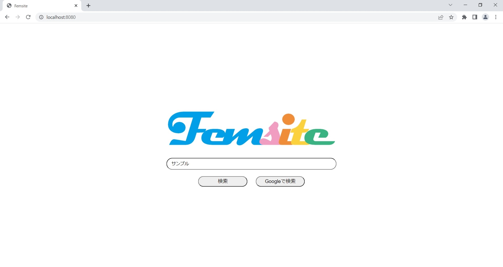
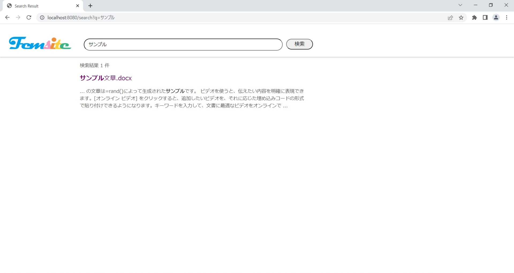

# Femsite

Femsite is the individual search engine.

It's only core structure to open to the public.

# Demo

We can easily search the local file in repository/seminer.

It returns this result.

# Features

1) This is the full-text search engine like Google.

   We can easily find the local files containing some keywords.

2) We can decide the algorithm for the display order we like.

   (src/main/java/com/femlab/femsite/service/SearchService.java)

# Note

This is the SAMPLE CODE. Not all code is published.

# Author

omori